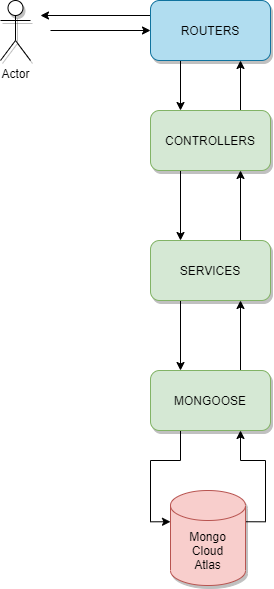

# TweetJS - Advanced

[[toc]]

## Appel d'une API externe

Pour cette partie là, nous allons ajouter un appel à une API externe via le protocole HTTP.
Pour les appels HTTP/HTTPS on va utiliser la librairie [axios](https://github.com/axios/axios) !

::: tip
Sachez qu'il en existe plein d'autres, par exemple (request, superagent, node-fetch...)
:::

L'avantage d'une librairie :

* ne pas avoir à manipuler directement l'objet `http` de NodeJS;
* est _promesifié_, toutes ses méthodes renvoient des promesses.

Voici ce que donne par exemple une requête `GET` : 

```javascript
const axios = require('axios');

async function main() {
    try {
        // on await bien l'appel à .get !!
        const response = await axios.get('https://quotes.rest/qod');
        console.log(response);
        const data = response.data;
        console.log(data);   
    } catch (err) {
        // on catch si il y a une erreur HTTP !
        
        // pas de réponse du serveur ! 
        if (!err.response) { 
            console.error('Unknown error during the request');
            throw err;
        }
    
        // on extrait de la réponse du serveur, le code, le body, et le status
        const {data, status, statusText} = err.response;
        console.error('Error during the request', status, statusText, data);
        throw err;
    }
} 

main();
```

::: tip Exercice 30min

Dans la route de détail d'un tweet, vous devez appeler l'API [randomuser](https://randomuser.me/documentation#format).
Cette API vous génère un utilisateur aléatoire.

> :bulb: tip. 1 : la page de l'API contient les informations pour appeler et le résultat du retour !

> :bulb: tip. 2 : essayer dans la requête dans le navigateur ou sur Postman !

Vous devez : 
* générer 3 utilisateurs différents (l'API peut en fournir plusieurs d'un coup ;) ) 
* afficher dans la page de détail une liste d'utilisateurs ayant aimé ce tweet :

> Les utilisateurs suivants ont aimés ce tweet :
> * Monsieur Prénom Nom - email => **si c'est un homme** !
> * Madame Prénom Nom - email => **si c'est une femme** !

::: spoiler Solution

On commence par installer la dépendance axios
```bash
npm install axios --save
```

Dans notre `app.js` on va importer axios...
```javascript
const axios = require('axios');
```

...et ajouter notre fonction d'appel à l'API...
```javascript
/**
* ma fonction prend en paramètre le nombre d'utilisateur qui sera généré.
* elle est asynchrone !
* @param number
* @return elle retourne un tableau d'utilisateurs
*/
async function getRandomUsers(number) {
    // je construis mon url avec le paramètre
    const url = `https://randomuser.me/api/?results=${number}`;
    
    let response;
    try {
        // on fait l'appel à l'API avec l'url. Toujours avec le `await`!
        response = await axios.get(url);
    } catch (err) {
        // on catch si il y a une erreur HTTP !
        // pas de réponse du serveur ! 
        if (!err.response) {
            console.error('Unknown error during the request');
            throw err;
        }
        // on extrait de la réponse du serveur, le code, le body, et le status
        const { data, status, statusText } = err.response;
        console.error('Error during the request', status, statusText, data);

        // si j'ai une erreur je retourne un tableau vide ici
        return [];
    }

    // je récupére l'objet results de mon body
    const results = response.data.results;

    // ici je construis un nouveau tableau avec le même nombre d'élément que mon tableau.
    // je ne choisis de retourner que ce que j'ai besoin !
    return results.map(elem => {

        let politness = 'Monsieur';
        if (elem.gender === 'female') {
            politness = 'Madame';
        }

        return {
            politness: politness,
            firstName: elem.name.first,
            lastName: elem.name.last,
            email: elem.email,
        }
    });
}
```

...et dans notre route on fait appel à notre fonction ...
```javascript
// il faut mettre la fonction de callback en `async`
app.get('/tweets/:id', async function (req, res) {
    const id = req.params.id;

    const tweet = tweets.find((elem) => {
        return elem.id === id;
    });

    // ici aussi on `await` bien la fonction asynchrone ! 
    const users = await getRandomUsers(3);

    // je passe à mon template mon tweet et mes utilisateurs
    res.render('tweet', { tweet, users });
});
```

...et pour finir dans notre template `tweet.hbs` on parcours le tableau de `users` pour afficher :
```handlebars
{{#if users}}
    <p><b>Les utilisateurs suivant ont aimé ce tweet :</b></p>
    {{#each users}}
    <p>{{politness}} {{firstName}} {{lastName}} - {{email}}</p>
    {{/each}}
{{else}}
    <p><b>Personne n'a aimé ce tweet :-(</b></p>
{{/if}}
```

:::

## Mongodb

Pour l'instant notre serveur stock ses tweets en mémoire.

Si on redémarre...on perd tout !

On va ajouter une base de données **MongoDb** dans lequel nous allons stocker nos tweets !

**MongoDb** est une base de données : 
* **non relationnelle** : il n'y a pas de schéma prédéfini et établi comme il peut avoir sur des base de données SQL (MySQL, Postgres...);
* **document-driven** : on ne stock pas une ligne dans des tables faites de colonne mais des documents JSON dans des collections;
* **permissif** : on peut stocker des documents différents dans une même collection;
* **facile d'implementation** : mongodb se marie très bien avec le JavaScript puisqu'on manipule des objets JSON !

Simplissime :
* 1 base de données contient N collections; 
* 1 collection contient N documents JSON;
* les requêtes se font en JSON ! 

::: warning
Même si nos documents peuvent être différents dans une même collection, il faut tout de même rester organiser et éviter de stocker n'importe quoi n'importe où !
:::

### MongoDb Atlas

::: tip Exercice 15min
* Créer un cluster Atlas
* Créer un utilisateur admin en copiant de mot de passe
* Créer une base de données tweetjs
* Créer une collection Tweet
* Importer le fichier json `tweet.json` sans le champs `id`
* Créer une connection de ce type `mongodb+srv://admin:<password>@cluster0.uflhz.mongodb.net/tweetjs?retryWrites=true&w=majority`

:::

### Mongoose

On utilise dans ce projet la librairie [mongoose](https://mongoosejs.com/).
Celle-ci va nous permettre de simplifier :

* la connexion à mongodb
* la structuration de nos collections
* les requêtes :)

On installe la dépendance :

```bash
npm install mongoose
```

On créé ensuite un fichier `database/mongodb.js` dans lequel nous allons mettre la connexion à la base cloud atlas.

```javascript
const mongoose = require('mongoose');

async function connect() {
    // on se connecte à la base de données
    try {
        // changer ici le password pour mettre celui que vous aviez copier + l'url de votre cluster !!
        await mongoose.connect('mongodb+srv://admin:<password>@cluster0.uflhz.mongodb.net/tweetjs?retryWrites=true&w=majority', { useNewUrlParser: true });
    } catch (err) {
        console.error('impossible de se connecter à la base de donnée', err);
        throw err;
    }

    console.info('connection to the database established...');
}

// on export ici la fonction connect
module.exports = connect;
```

On se connecte dans notre `app.js` :

```javascript
// on importe notre fonction
const connect = require('./database/mongodb');

// on se connecte
connect()
```

En lancant on a bien le `connection to the database established...` !!

### Schéma et Requête

Mongoose a besoin pour faire la liaison entre la collection mongodb et ce qu'il va créer/récupérer d'un schéma et d'un Model.

* le schéma structure notre document !
* le Model nous permettra de réaliser les requêtes !

On créé un fichier `models/tweet.js` dans lequel nous allons exporter un Model 
```javascript
const mongoose = require('mongoose');

const Schema = mongoose.Schema;

// le schéma structure le document que l'on va utiliser sur notre projet
// on y définit les champs et les types !!
const tweetSchema = new Schema({
    user: String, 
    title: String,
    content: String,
    createdAt: Date, // on ajoute ici une date de création !
});

// on créé un model de notre tweet (attention la collection doit être égal au nom de notre model au pluriel !!)
module.exports = mongoose.model('tweet', tweetSchema);
```

Utilisons les requêtes à la base de données pour accéder/créer des tweets !

* Dans notre app.js on importe notre modèle;
* Celui-ci contient toutes les fonctions utiles : **find**, **findById**, **save**, **sort** ... etc

```javascript
// on supprime la ligne qui importait notre fichier json et celle du uuid ! Mongodb génére automatiquement les ids
const Tweet = require('./models/tweet');

// notre route /tweets est modifié pour récupérer tous les tweets
// on en profite pour sort par la date de création en descendant (-1) !
app.get('/tweets', async (req, res) => {
    const tweets = await Tweet.find({}).sort({ createdAt: -1 });
    res.render('tweets', { tweets });
});

// notre route /tweets/:id est modifié pour utiliser la fonction mongoose findById !
app.get('/tweets/:id', async function (req, res) {
    const id = req.params.id;

    const tweet = await Tweet.findById(id);
    const users = await getRandomUsers(3);

    res.render('tweet', { tweet, users });
});

// notre route POST /tweets est modifiée pour créer un nouveau Tweet à partir du body de la requête !
// le .save() permet de lancer la requête de création de notre objet à mongodb
app.post('/tweets', async (req, res) => {
    const paramTweet = req.body;
    const tweet = new Tweet({
        title: paramTweet.title,
        content: paramTweet.content,
        user: paramTweet.user,
        createdAt: new Date(),
    });
    await tweet.save();
    res.redirect('/tweets');
});
``` 

::: tip Exercice 30min

Le but est de créer pour chaque tweet une liste de commentaires :

* Créer une nouvelle collection `comments`;
* Créer un schéma qui contient les params puis son model dans le fichier `models/comment.js`. 
```json
{
  "user": "string",
  "comment": "string",
  "createdAd": "Date",
  "tweetId": "ObjectId"
}
```
* Créer une route POST `/api/tweets/:id/comments` qui permet de créer un commentaire à partir d'un id de tweet;
* Créer une route GET `/api/tweets/:id/comments` qui permet de récupérer tous les commentaires à partir d'un id de tweet;
* Modifier la route GET `/tweets/:id` pour envoyer au template les commentaires liées à l'id du tweet trier du plus récent au plus ancient;
* Modifier le template `views/tweet.hbs` pour les afficher !

> :bulb: tip 1. Il vous faudra le type `ObjectId` pour le `tweetId` qui se trouve dans `Schema.ObjectId`.

> :bulb: tip 2. Pour trouver tous les commentaires d'un tweet, vous pouvez utilisez la fonction `.find()` du Model mongoose.

> :bulb: tip 3. La fonction `.find()` prend en paramètre un objet `.find({tweetId: id})` 

::: spoiler Solution

* Notre schéma `models/comment.js`
```javascript
const mongoose = require('mongoose');

const Schema = mongoose.Schema;
const ObjectId = Schema.ObjectId;

const tweetSchema = new Schema({
    user: String,
    comment: String,
    createdAt: Date,
    tweetId: ObjectId // je met ici l'ObjectId de notre tweetId
});

module.exports = mongoose.model('comment', tweetSchema);
```

* Notre route `POST /api/tweets/:id/comments`
```javascript
const Comment = require('./models/comment');

app.post('/api/tweets/:id/comments', async function (req, res) {
    const tweetId = req.params.id;
    const paramComment = req.body;

    // on met ici un peu de gestion d'erreur !
    let tweet;
    try {
        tweet = await Tweet.findById(tweetId);
    } catch (err) {
        console.error('oops une erreur ', err);
        return res.status(400).send(err.message);
    }

    if (!tweet) {
        console.error('tweet not found !');
        return res.status(404).send();
    }

    // on créé notre comment
    const comment = new Comment({
        user: paramComment.user,
        comment: paramComment.comment,
        createdAt: new Date(),
        tweetId: tweetId
    });

    // on le save et on le renvoi !
    const created = await comment.save();
    res.send(created);
});
```

* Notre route `GET /api/tweets/:id/comments`
```javascript

// on créé une fonction asyncrhone qui renvoi le sort et le find
async function getCommentsByTweetId(tweetId) {
    return Comment.find({ tweetId: tweetId }).sort({ createdAt: -1 });
}

app.get('/api/tweets/:id/comments', async function (req, res) {
    const tweetId = req.params.id;

    let comments;
    try {
        // on appelle notre fonction que l'on `await`
        comments = await getCommentsByTweetId(tweetId);
    } catch (err) {
        console.error('oops une erreur ', err);
        return res.status(400).send(err.message);
    }

    res.send(comments);
});
```

* Notre route `GET /tweets/:id`
```javascript
app.get('/tweets/:id', async function (req, res) {
    const id = req.params.id;

    const tweet = await Tweet.findById(id);
    // on ajoute la récupération des comments !
    const comments = await getCommentsByTweetId(id);
    const users = await getRandomUsers(3);

    res.render('tweet', { tweet, users, comments });
});
```

* Notre template `views/tweet.hbs`
```handlebars
{{#if comments}}
    <p><b>Commentaires :</b></p>
    {{#each comments}}
        <p>{{user}} : {{comment}}</p>
    {{/each}}
{{else}}
    <p><b>Personne n'a commenté ce tweet :-(</b></p>
{{/if}}
```

:::

## Architecture

::: tip Question 
Quel est le problème avec notre architecture actuelle ?
Quelles sont les différentes responsabilité ici ?
:::

Pour le moment on a : 

* l'initialisation de notre serveur (`app.listen`); => `app.js`
* la définition de routes (`app.get` / `app.post`); => `app.js`
* un service qui appelle une API externe (`randomuser`); => `app.js`
* du code métier à notre application (`sort`, `map`, `push` ...); => `app.js`
* des modifications de la réponse du serveur (`res.send()`, `res.status()`); => `app.js`
* des vues `.hbs`; => dossier `views`
* des modèles; => dossier `models`
* une connection à une base de données. => dossier `database`

Outch ! La quasi-totalité des responsabilités sont mélangées dans l'`app.js` !

### Architecture par couches

Cette architecture regroupe par couche les responsabilités : routers, controllers, services, accès aux données (DAL).



Séparer les résponsabilités permet :

* de changer une couche sans impacter les autres
* de maintenir du code privé dans certains services 
* d'utiliser les services qu'importe la couche appelante (Controller, CRON, Scripts ...);
* la stabilité de l'application

Les différentes couches : 
* **Mongoose** : c'est notre couche d'accès aux données.
* **Services** : c'est la couche où le code métier est présent. On peut avoir des dépendances à d'autres services ici.
* **Controller** : c'est la couche qui parse la requête et créer la réponse. On peut appeler plusieurs services ici.
* **Routers** : c'est la couche où l'on définie nos routes. Elle Permet de les compartimenter.

### Injection de Dépendance (DI)

Le but est de découpler les dépendances entre nos briques logiciels (service, controller ...). 
Pour cela les dépendances internes de notre serveur qui sont statiques avec `require` sont modifiées pour être dynamique.

Comment ? En injectant l'instance de la dépendance à la création de l'instance qui en a besoin.

::: spoiler Sans Injection de Dépendance
```javascript
const Tweet = require('../models/tweet');
class Service {
    constructor() {}

    getTweets() {
        return Tweet.find({});
    }
} 

module.exports = Service;
```

//
```javascript
// la dépendance est statique, pour changer de service il faut changer toutes les dépendances :(
const Service = require('../services/Service');

class Controller {
    constructor() {
        this.service = new Service();
    }

    getTweets() {
        // other treatments ...
        const tweets = this.service.getTweets();
        // other treatments ...
    }
}

module.exports = Controller;
```

```javascript
const Controller = require('./controllers/controller');
const controller = new Controller();
```
:::


::: spoiler Avec Injection de Dépendance
```javascript
const Tweet = require('../models/tweet');
class Service {
    constructor() {}

    getTweets() {
        return Tweet.find({});
    }
} 

module.exports = Service;
```

```javascript
// il n'y a plus de dépendance vers le module service
class Controller {
    // on injecte la dépendance service que l'on stock dans un attribut à la création d'une instance de Controller
    constructor(service) {
        this.service = service;
    }

    getTweets() {
        // other treatments ...
        const tweets = this.service.getTweets();
        // other treatments ...
    }
}

module.exports = new Controller();
```

```javascript
const Controller = require('./controllers/controller');
const Service = require('./services/service');

// création du service
const service = new Service();
// creéation du controller avec la dépendance du service
const controller = new Controller(service);
```

Le controller a besoin d'un service pour fonctionner mais il ne dépend plus directement de notre module Service.

::: tip Questions
* Doit-on s'assurer que le service injecté soit bien une instance de Service ?
* Doit-on s'assurer que le service injecté ait bien une fonction getTweets ?
* Si `A => B => C => D, F, G`, faut-il instancier toutes les classes et injecter manuellement les dépendances ?

:::

### TweetJS modulaire

Nous allons architecturer notre code sur les principes que l'on vient de voir :


::: tip 
Sachez que l'on aurait pu architecturer par composants ! 
:::

On commence par créer le fichier `services/comment.service.js` :
On ne fait que déplacer le code de `app.js` dans notre classe.

```javascript
const Comment = require('../models/comment');

// Une class CommentService
class CommentService {
    constructor() { }

    async create(tweetId, comment) {
        const created = new Comment({
            user: comment.user,
            comment: comment.comment,
            createdAt: new Date(),
            tweetId: tweetId
        });

        await created.save();
        return created;
    }

    async getByTweetId(tweetId) {
        return Comment.find({ tweetId: tweetId }).sort({ createdAt: -1 });
    };
}

// on n'oublie pas d'exporter notre Service
module.exports = CommentService;
```

On fait le controller `controllers/comment.controller.js` :

```javascript
const CommentService = require('../services/comment.service');

class CommentController {
    constructor() {
        // on créé une nouvelle instance de CommentService que l'on ajoute à notre attribut
        this.commentService = new CommentService();
    }

    async create(req, res) {
        const comment = req.body;
        const tweetId = req.params.id;

        // on fera la vérification de l'existence du tweet en Exercice

        const created = await this.commentService.create(tweetId, comment);
        res.send(created);
    }

    async getByTweetId(req, res) {
        const tweetId = req.params.id;

        // on fera la vérification de l'existence du tweet en Exercice

        const comments = await this.commentService.getByTweetId(tweetId);
        res.send(comments);
    }
}

// on n'oublie pas d'exporter notre Controller
module.exports = CommentController;
```

On fait ensuite le router `routers/comment.router.js` :

```javascript
const express = require('express');
const CommentController = require('../controllers/comment.controller');

// on créé une nouvelle instance de notre controller !
const commentController = new CommentController();
// on spécifie le router express
const router = express.Router();

// On définis nos routes 
router.post('/api/tweets/:id/comments', async (req, res) => {
    commentController.create(req, res);
});

router.get('/api/tweets/:id/comments', async function (req, res) {
    commentController.getByTweetId(req, res);
});

// ici pas de classe, on export directement l'objet route
module.exports = router;
```

Dans notre `app.js` on peut supprimer le code des deux routes et ajouter notre router !

```javascript
// on récupére notre router
const commentRouter = require('./routers/comment.router');
// on indique à notre app de l'utiliser
app.use('/', commentRouter);
```

::: tip Exercice 30min
Faites la même chose pour les autres routes en découpant en couches !

::: spoiler Solution

`services/tweet.service.js`

```javascript
const Tweet = require('../models/tweet');

class TweetService {
    constructor() { }

    async getAll() {
        return Tweet
            .find({})
            .sort({ createdAt: -1 });
    }

    async create(tweet) {
        const created = new Tweet({
            title: tweet.title,
            content: tweet.content,
            user: tweet.user,
            createdAt: new Date(),
        });
        await created.save();
        return created;
    }

    async get(id) {
        try {
            return Tweet.findById(id);
        } catch (err) {
            console.error('tweet not found !', err);
            return null;
        }
    }
}

module.exports = TweetService;
```

`api/randomuser.api.js`

```javascript

const axios = require('axios');

class RandomUserApi {
    constructor() {
        this.url = 'https://randomuser.me/api/';
    }

    async getRandomUsers(number) {
        const randomUrl = `${this.url}?results=${number}`;

        let response;
        try {
            response = await axios.get(randomUrl);
        } catch (err) {
            if (!err.response) {
                console.error('Unknown error during the request');
                throw err;
            }

            const { data, status, statusText } = err.response;
            console.error('Error during the request', status, statusText, data);
            return [];
        }

        const results = response.data.results;

        return results.map(elem => {

            let politness = 'Monsieur';
            if (elem.gender === 'female') {
                politness = 'Madame';
            }

            return {
                politness: politness,
                firstName: elem.name.first,
                lastName: elem.name.last,
                email: elem.email,
            }
        });
    }
}

module.exports = RandomUserApi;
```

`controllers/tweet.controller.js`

```javascript
const TweetService = require('../services/tweet.service');
const CommentService = require('../services/comment.service');
const RandomUserApi = require('../api/randomuser.api');

class TweetController {
    constructor() {
        this.tweetService = new TweetService();
        this.commentService = new CommentService();
        this.randomUserApi = new RandomUserApi();
    }

    async create(req, res) {
        const tweet = req.body;

        const created = await this.tweetService.create(tweet);

        res.redirect('/tweets');
    }

    async getAll(req, res) {
        const tweets = await this.tweetService.getAll();

        res.render('tweets', { tweets });
    }

    async get(req, res) {
        const id = req.params.id;

        const tweet = await this.tweetService.get(id);

        if (!tweet) {
            console.error('error tweet not found with id ', id);
            return res.status(404).send();
        }

        const comments = await this.commentService.getByTweetId(id);
        const users = await this.randomUserApi.getRandomUsers(3);

        res.render('tweet', { tweet, comments, users });
    }
}

module.exports = TweetController;
```

`routers/tweet.router.js`

```javascript
const express = require('express');
const TweetController = require('../controllers/tweet.controller');

const tweetController = new TweetController();
const router = express.Router();

router.get('/tweets', async (req, res) => {
    tweetController.getAll(req, res);
});

router.get('/tweets/new', async (req, res) => {
    res.render('new');
});

router.get('/tweets/:id', async function (req, res) {
    tweetController.get(req, res);
});

router.post('/tweets', async (req, res) => {
    tweetController.create(req, res);
});

module.exports = router;
```

`app.js`

```javascript
// on récupére notre dépendance externe - ici express.
const express = require('express');
const logger = require('morgan');
const connect = require('./database/mongodb');
const commentRouter = require('./routers/comment.router');
const tweetRouter = require('./routers/tweet.router');

// on construit notre application qui nous servira à créer nos routes
const app = express();
// on donne un port sur lequel notre serveur écoute
const port = 3000;

// on ajoute à notre app les middlewares
app.use(express.json());
app.use(express.urlencoded({ extended: false }));
app.use(logger('dev'));

// on se connect à la base de données
connect();

// on indique d'utiliser le moteur handlebars
app.set('view engine', 'hbs');

app.get('/', (req, res) => {
    res.render('index');
});

// on indique les routers à ajouter !
app.use('/', commentRouter);
app.use('/', tweetRouter);

// on écoute sur notre port.
app.listen(port, () => {
    console.log(`TweetJS listening at http://localhost:${port}`)
});
```

:::


### Pour aller plus loin...

Quelques idées pour aller plus loin :
* configuration dotenv;
* requêtes ajax;
* authentification.
