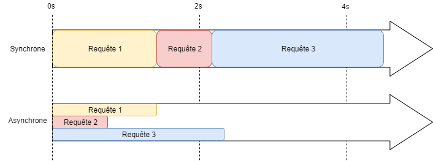

# NodeJS

[[toc]]

NodeJS en quelques points c'est : 

* un **environnement d'éxecution** JavaScript;
* **Asynchrone** et **Evénementiel** => ce qui le rend non bloquant;
* Basé sur le **moteur JavaScript V8** de Google.

**+**

* Executer du JavaScript côté **Serveur**;
* Permet de réaliser des applications extensibles;
* Permet de réaliser des **APIs** et **Serveur Web** simplement.

**-**

* Réaliser des applications de calcul lourd, notamment CPU (IA, machine learning...)

## Histoire

Créé par Ryan Dahl avec une première version en 2009.

Pour comparer :
* Java : 1996
* C++ : 1983 

en 2020 : 
* Version LTS : 14.X
* JavaScript - Language de programmation le plus actif sur [Github](https://madnight.github.io/githut/#/pull_requests/2020/3).

## Asynchrone

NodeJS est non bloquant, il :

* execute le code JavaScript sur un seul processus (thread) !
* utilise une boucle événementiel
* utilise une file d'attente FIFO (first-in first-out) pour ses opérations asynchrones
* toutes les opérations I/O bloquantes sont gérées par des callbacks (lecture fichier, requête réseau ...)

Sur un serveur comment ca marche ?



* Les requêtes ne sont pas bloquantes !
* 1 requête => opération asynchrone => X callbacks
* Le callback n'est pas executé directement !

## Modulaire

NodeJS conceptualise chaque fichier JavaScript en un **module**.
1 fichier = 1 module.

Un **module** :
* choisi ses éléments exportées en modifiant l'objet `module.exports`;
* peut importer d'autres modules en utilisant `require`. On importe ici une référence;
* est mise en cache à la premiere importation (si A et B importent C, ils utilisent le même module C).

```javascript
/** module.js *******************************/
// ce module est rendu disponible par NodeJS ,il permet de réaliser des opération I/O 
const fs = require('fs');

const doSomething = (arg) => {
    // do something
};

const constant = 'ma constante';
const object = {};

// il est interne et non exporter.
const nonExport = 'pas exporter';

// Ici je dis que mon module `module` exports des propriétés qui seront accessibles à l'extérieur.
// Elle peut exporter n'importe quel type !
module.exports = {
    doSomething: doSomething,
    constant: constant,
    object: object
}
/********************************************/

/** autreModule.js **************************/
// on import notre module ...
const monModule = require('./module');

const foo = async (arg) => {
    // Ses propriétés sont utilisables !
    monModule.doSomething(arg);
    console.log(monModule.constant); // = ma constante
    console.log(monModule.object); // = {}
    console.log(monModule.nonExport); // = undefined ! car l'objet monModule ne contient pas les données non exportés
};

// ici on export directement la fonction !! 
module.exports = foo;
/********************************************/
```

::: tip Questions
* Que se passe t-il si l'on importe `autreModule` ? 
* Peut-on importer que ce qu'il nous intéresse dans un `module` ?
* Que se passe t-il si : A importe B et B importe A ?
* Peut-on exporter une classe ?
* Si j'exporte dans un module A une instance d'une classe, et que je l'importe dans les modules B et C, aurai-je la même instance?

::: spoiler Solution
```javascript
// module Person
class Person {
    constructor(firstName, lastName) {
        // on déclare les attributs à l'aide du mot-clé this dans le constructeur
        this.firstName = firstName;
        this.lastName = lastName;
    }
    
    name() {
        return this.firstName + ' ' + this.lastName;
    }
}

module.exports = Person;

// module app
const Person = require('person');
const stefan = new Person('stefan', 'michalet');
```
:::

## NPM

NPM pour (Node Package Manager) est un gestionnaire de paquets permettant à chacun de publier et/ou de récupérer des librairies et autres outils communautaires de l'écosystème NodeJS.
Il n'est pas rare de trouver un paquet qui fait ce que l'on cherche à faire. 

::: tip
Ne pas réinventer la roue ! Si un paquet est robuste, testé et maintenu, utilez-le !
:::

NPM se base sur :
* un fichier `package.json` qui configure les dépendances du projet;
* un dossier `node_modules` qui contient le code installé des dépendances.

Comment cela marche en pratique ?

* d'autres développeurs publient des packages sur NPM. Ils ont un scope et un nom unique. Ils peuvent posséder plusieurs versions !
* on peut les installer avec la commande `npm install @package-name`.
* on peut les importer comme les modules avec `require`!

```bash
npm install moduleNpm@version
npm install @scope/module
```

```javascript
const moduleNpm = require('moduleNpm');
const { exportedElement } = require('@scope/module');
```

## Express

[Express](https://expressjs.com/fr/) est une surcouche à NodeJS nous permettant de :

* simplifier les développements de Serveur et d'API !
* rendre modulable les développements avec les routeurs, middleware ...

::: tip
Ils existent d'autres alternatives comme par exemple [Koa](https://koajs.com/) - développé par d'anciens contributeurs à Express.
:::