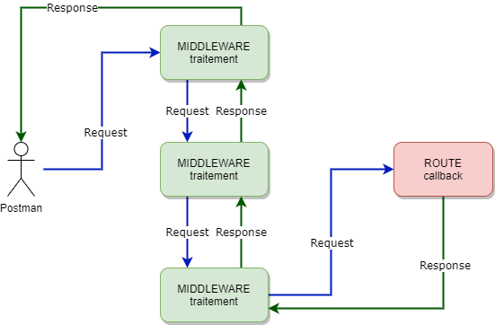

# TweetJS - Basic

[[toc]]

## Initialisation

Nous allons créer pas à pas un petit site de tweets à l'aide de :

* **NodeJS** : pour executer notre serveur;
* **NPM** : un gestionnaire de paquets, pour gérer nos dépendances;
* **Express** : une surcouche à NodeJS pour simplifier la création d'un serveur NodeJS;
* **Handlebars** : un moteur de template pour afficher notre site dynamiquement.
* **Mongodb** : une base de données document-driven.

### NPM Init

Commençons par créer un dossier et lançons la commande `npm init`. 
On laisse les champs par défaut.

```bash
mkdir TweetJS && cd TweetJS
npm init
```

### Express Hello World

Installons maintenant express.js :

```bash
npm install express --save
```

On va créer le fichier d'entrée de notre application, c'est à dire celui qui sera executé par NodeJS.

On créé le fichier `app.js`.

```javascript
// on récupére notre dépendance externe - ici express.
const express = require('express');
// on construit notre application qui nous servira à créer nos routes
const app = express();
// on donne un port sur lequel notre serveur écoute
const port = 3000;

// notre première route !
// on envoi un Hello World si la requête est sur la racine.
app.get('/', (req, res) => {
  res.send('Hello World!')
});

// on écoute sur notre port.
app.listen(port, () => {
  console.log(`TweetJS listening at http://localhost:${port}`)
});
```

::: tip
Remarquez qu'ici tout est asynchrone et passe par des callbacks ! C'est un des principes fondamentaux des serveurs NodeJS.
:::

Lançons l'application : 

```bash
node app.js
```

Le `Hello world` est affiché à l'adresse `http://localhost:3000/`

### Le déboggueur

Le déboggueur nous permet de s'arreter dans notre programme pour vérifier son état à un temps T.
Et lancer l'execution pas à pas !

### Express Middleware

Un `middleware` express, c'est un bout de code qui est exécuté avant ET après le callback de notre route.



### Logger de requêtes

On peut évidemment utilisé les `console.log()` et `console.error()` mais il existe d'autre logger plus puissant permettant notamment de logguer les requêtes envoyées à notre serveur.
Nous allons utilisé [morgan](http://expressjs.com/en/resources/middleware/morgan.html).

Ici morgan est utilisé avant l'appel de notre callback pour logguer notre requête.
Puis après pour logguer le temps de réponse et le status.

* Installation
```bash
npm install morgan --save
```

* Usage
```javascript
const logger = require('morgan');
app.use(logger('dev'));
```

## Premières routes

On va ajouter une route POST à notre serveur !
Une requête POST va souvent de pair avec un body !

Pour que notre serveur puisse le récupérer ils nous faut aussi un `middleware` express !
On peut évidemment l'écrire nous même mais il en existe déjà qui font ce que l'on cherche.

Dans notre `app.js` :

* on ajoute notre middleware à l'application.
* on ajoute ensuite notre route POST /tweets

```javascript
app.use(express.json());

app.post('/tweets', (req, res) => {
    const body = req.body;
    console.log(body);
    res.send(body);
});
```

On essaye sur postman : 

* POST http://localhost:3000/tweets
* Body : application/json 
```json
{
    "title": "Mon tweet",
    "user": "Stefan",
    "content": "Bienvenue à tous dans ce cours !"
}
```

On créé notre page `index.html` sous un nouveau dossier `views`:

```html
<!doctype html>

<html lang="fr">

<head>
    <meta charset="utf-8">
    <!-- On va utiliser bootstrap CSS -->
    <link rel="stylesheet" href="https://stackpath.bootstrapcdn.com/bootstrap/4.5.0/css/bootstrap.min.css" integrity="sha384-9aIt2nRpC12Uk9gS9baDl411NQApFmC26EwAOH8WgZl5MYYxFfc+NcPb1dKGj7Sk" crossorigin="anonymous">

    <title>TweetJS</title>
</head>

<body>
    Hello World !
</body>

</html>
```
 
On modifie notre route racine pour envoyer une page html.
La directive `__dirname` est égal au dossier racine du fichier app.js.

```javascript
app.get('/', (req, res) => {
    res.sendFile(__dirname + '/views/index.html');
});
```

Tout ça est très statique ! Comment rendre notre page plus dynamique ?

## Templates handlebars

On va utiliser un moteur de template. Ici [Handlebars](https://handlebarsjs.com/).
Il va nous permettre de rendre dynamique certaine partie du html.

A l'aide de block à base de double moustache directement dans le Html NodeJS modifiera son contenu avant de servir la page.

```handlebars
{{title}}
```

on peut aussi utiliser le `.` si on veut une propriété d'un objet : 
```handlebars
{{tweet.title}}
```

Quelques expressions avec du Html : 

* boucle :
```handlebars
<div>
{{#each tweets}}
    <div>
        <p>{{title}} </p>
        <p>{{content}}</p>
    </div> 
{{/each}}
</div>
```

* condition : 
```handlebars
{{#if isActive}}
  
{{/if}}
```

Dans notre fichier `app.js` modifions notre code pour ajouter le moteur handlebars avec Express.

* On installe la dépendance : 
```bash
npm install hbs --save
```

* On indique à l'app d'utiliser le moteur :
```javascript
app.set('view engine', 'hbs');
// on indique que nos vues se trouverons toujours dans le dossier views 
app.set('views', path.join(__dirname, 'views'));
```

* dans notre route racine `/` on appelle cette-fois ci la méthode `render` avec un objet !
```javascript
app.get('/', (req, res) => {
    res.render('index', { name: 'TweetJS' });
});
```
* on renomme notre `index.html` en `index.hbs` pour qu'il soit pris en compte par le moteur.
* dans notre `index.hbs` on utilise handlebars pour ajouter le `name`.

```handlebars
<!doctype html>

<html lang="fr">

<head>
    <meta charset="utf-8">
    <!-- On va utiliser bootstrap CSS -->
    <link rel="stylesheet" href="https://stackpath.bootstrapcdn.com/bootstrap/4.5.0/css/bootstrap.min.css" integrity="sha384-9aIt2nRpC12Uk9gS9baDl411NQApFmC26EwAOH8WgZl5MYYxFfc+NcPb1dKGj7Sk" crossorigin="anonymous">

    <title>TweetJS</title>
</head>

<body>
    Vous êtes bien sur la page d'accueil de {{name}}.
</body>

</html>
```

Notre page d'accueil affiche maintenant : `Vous êtes bien sur la page d'accueil de TweetJS` !

Pour améliorer un petit peu l'affichage nous allons utilisé le `layout.hbs` de hbs.
Cela nous permet de ne pas répéter les en-tête html pour chaque page !

Le fichier `layout.hbs` :
```handlebars
<!DOCTYPE html>
<html>

<head>
    <title>TweetJS</title>
    <!-- Bootstrap CSS -->
    <link rel="stylesheet" href="https://stackpath.bootstrapcdn.com/bootstrap/4.5.0/css/bootstrap.min.css"
        integrity="sha384-9aIt2nRpC12Uk9gS9baDl411NQApFmC26EwAOH8WgZl5MYYxFfc+NcPb1dKGj7Sk" crossorigin="anonymous">
</head>

<body>
    {{{body}}}
</body>

</html>
```

Le fichier `index.hbs` devient :
```handlebars
Vous êtes bien sur la page d'accueil de {{name}}.
```

On vérifie que tout s'affiche comme il faut !

## Page de tweets

::: tip Exercice 30min 
Mettre en place :

* un fichier `tweets.json` qui contient une liste de tweets avec comme attributs : 
```json
{
  "id": "", // id unique !
  "title": "", // titre du tweet
  "user": "", // nom de l'utilisateur
  "content": "", // contenu
}
```
* une route GET /tweets qui renvoi un fichier `tweets.hbs` avec le tableau de tweets;
* un template `tweets.hbs` qui affiche la liste des tweets avec leurs propriétés sauf l'id !;
* ce template doit avoir un bouton vers la route `/tweets/{id}` avec la propriété id du tweet !;
* modifier votre route POST /tweets pour qu'elle ajoute un tweet à votre liste de tweets en générant un id.

> Petite aide pour générer un id vous pouvez utiliser la librairie [uuid](https://www.npmjs.com/package/uuid) et sa méthode `uuidv4()` !

```bash
npm install uuid --save
```

```javascript
// on require uuid v4 !
const { v4: uuidv4 } = require('uuid');
// Si on l'utilise, il nous génère un id unique !
uuidv4(); // ⇨ '1b9d6bcd-bbfd-4b2d-9b5d-ab8dfbbd4bed'
```
::: spoiler Solution 

* `tweet.json`
```json
[
    {
        "id": "1",
        "user": "Memphis Depay",
        "title": "Pensées sur le foot",
        "content": "Le foot c'était vraiment mieux quand on pouvait y jouer ! \n Prochaine pensée dans 24h."
    },
    {
        "id": "2",
        "user": "Zinedine Zidane",
        "title": "Mon plus beau but",
        "content": "Clairement, c'est celui contre Materazzi ... ah non pardon !"
    },
    {
        "id": "3",
        "user": "Ribery",
        "title": "La roue va tourner",
        "content": "C'est sur cette fois, la roue tourne va tourner."
    }
]
```

* `tweets.hbs` avec un peu de bootstrap
```handlebars
<h2>Les derniers tweets !</h2>

<div class="container-fluid">
    <a style="margin: 5px 20px 5px 20px;" id="next" href="/tweets/new" class="btn btn-primary">Nouveau tweet !</a>

    {{#each tweets}}
    <div class="row" style="margin: 5px 20px 5px 20px;">
        <div class="card" style="width: 100%; max-width: 50rem;">
            <div class="card-body">
                <h5 class="card-title">{{title}}</h5>
                <h6 class="card-subtitle mb-2 text-muted">{{user}}</h6>
                <p class="card-text">{{content}}</p>
                <a href="/tweets/{{id}}" class="card-link">Voir ce tweet</a>
            </div>
        </div>
    </div>
    {{/each}}
</div>
```

* nos routes dans le `app.js` 
```javascript
app.get('/tweets', (req, res) => {
    res.render('tweets', { tweets });
});

app.post('/tweets', (req, res) => {
    const tweet = req.body;
    tweet.id = uuidv4();
    tweets.push(tweet);
    res.send(tweet);
});
```
:::

## Page nouveau tweet

L'API pour ajouter un tweet est pratique mais ce serait bien d'avoir un formulaire.
Ajouter le fichier `new.hbs` dans nos vues qui contient un formulaire : 

```handlebars
<h2>Nouveau tweet !</h2>

<div class="container-fluid">
    <form method="post" action="/tweets">
        <div class="form-group">
            <label for="user">Utilisateur</label>
            <input name="user" type="text" class="form-control" id="user">
        </div>
        <div class="form-group">
            <label for="title">Titre</label>
            <input name="title" type="text" class="form-control" id="title" aria-describedby="titleHelp">
        </div>
        <div class="form-group">
            <label for="content">Contenu</label>
            <textarea name="content" class="form-control" id="content" rows="3"></textarea>
        </div>
        <button type="submit" class="btn btn-primary">Envoyer</button>
        <a href="/tweets" class="btn btn-cancel">Annuler</a>
    </form>
</div>
```

Ce formulaire utilise la même API POST /tweets ! Mais attention car il envoie les données encodées dans l'url, et non pas en JSON.
Il nous faut donc un middleware spécifique pour que l'on y ai accès dans le `req.body`:

```javascript
app.use(express.urlencoded({ extended: false }));
```
 
On va modifier notre route pour qu'elle nous renvoie vers la page de tweets !

```javascript
app.post('/tweets', (req, res) => {
    const body = req.body;
    tweets.push(body);
    res.redirect('/tweets');
});
```

Et ajouter un bouton pour ajouter un tweet dans notre fichier `tweets.hbs`!
```handlebars
<a style="margin: 5px 20px 5px 20px;" id="next" href="/tweets/new" class="btn btn-primary">Nouveau tweet !</a>
```

## Page de détail

On a le bouton mais pas la route ni le template. 
La route est un peu spécifique car elle est dynamique par rapport à l'id de la page.
On met un `:` devant la variable et on la récupère dans l'objet `req` - `req.params.id`

Il faut chercher ensuite le tweet en question dans notre liste par rapport à son id !
On peut utiliser pour cela la méthode [find](https://developer.mozilla.org/fr/docs/Web/JavaScript/Reference/Objets_globaux/Array/find)

::: tip Exercice 20min

Faire la page de détail avec la route GET `/tweets/:id`.

> :warning: Attention à bien mettre la définition de la route /tweets/:id après celle de /tweets/new ! Pourquoi ?

::: spoiler Solution

```javascript
app.get('/tweets/:id', function(req, res) {
    const id = req.params.id;
    
    const tweet = tweets.find((elem) => {
        return elem.id === id; 
    });

    res.render('tweet', { tweet });
});
```

Notre fichier `tweet.hbs` :

```handlebars
<div style="margin: 5px 20px 5px 20px;">
{{#with tweet}}
    <h3>Tweet de {{user}}</h3><br />

    <p><b>Titre :</b> {{title}}</p>
    <p><b>Contenu :</b> {{content}}</p>

    <a href="/tweets" class="card-link">Retour</a>
{{/with}}
</div>
```
:::
